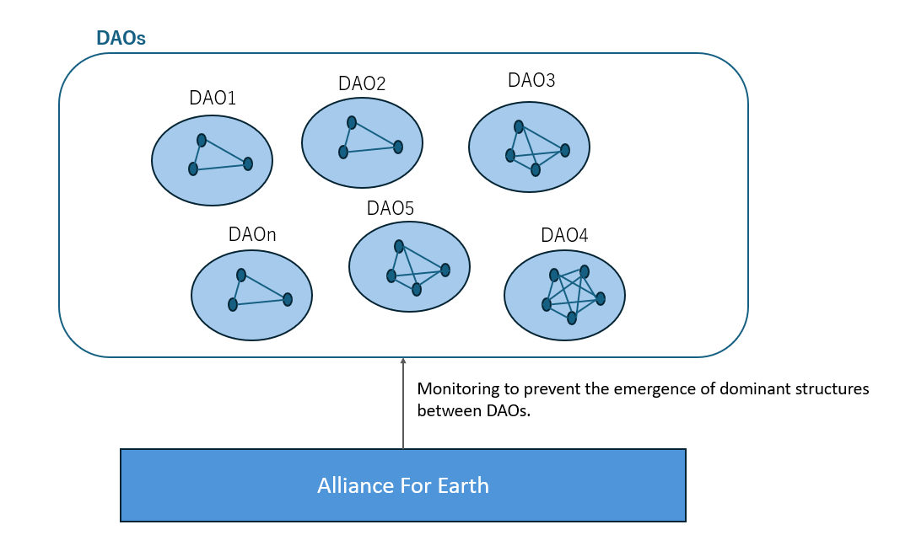

# Community in the Age of Wind
By 2026, it is told that Earth will ascend to the 5th dimension. In the post-ascension Earth, an era of anarchy is predicted, and numerous small-scale blockchain-based organizations called DAOs (Decentralized Autonomous Organizations) are expected to form. Similar to Japan’s Jomon period, where like-minded individuals formed communities and celebrated true diversity by honoring each person’s uniqueness, this new era will prioritize individuality.

However, even in the 5th dimension, there remains a risk of power structures emerging among DAOs. The Earth Alliance, currently combating DS, is expected to serve as a watchdog in this context. While internal power structures within DAOs are also conceivable, over-interference should be avoided, and community-based solutions encouraged.

To prevent the emergence of dominating structures, we can draw inspiration from the transformation of Anakin Skywalker into Darth Vader in Star Wars Episodes 1-3. Anakin’s identity was rooted in protecting his loved ones, including his mother and Padmé. However, Jedi principles directly contradicted this, emphasizing detachment and obedience to orders. This conflict led Anakin to question the supposedly just Jedi Order, ultimately pushing him toward the dark side.

From this, we learn two essential principles:

Distinguish Self from Others: Whether within DAOs or elsewhere, recognizing individuality and avoiding rigid distinctions between self and others is crucial.
Avoid Limiting Value Systems: Refrain from imposing restrictive rules on value systems, both within and outside DAOs.
To achieve these principles, each individual (those aspiring to reach the 5th dimension) must engage in introspection, listen to their soul’s voice, and uncover their true identity. Technologically, we can implement measures such as separating authority between DAOs, leveraging quantum computing and AI for fraud detection, and using blockchain to prevent data tampering.

Remember, simplicity holds the key to a harmonious and diverse future.
