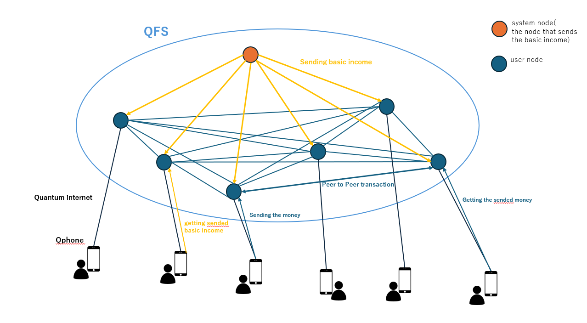

 # Technology of the Age of Wind
 It is said that various space technologies will flourish in the coming era of the wind. The basis of space technology is quantum technology, which is being developed under the surface (or maybe it is already completed?). Some of these technologies are as follows:

- Medbed
- Replicator
- Utilizer
- Quantum computer
- Quantum internet
- QFS (Quantum Financial System)
- Qphone 

Medbed uses plasma energy to repair/improve DNA itself, and is used for treating diseases and improving immunity.  
Personally, I think that something that can be cured by just sticking a patch on the affected area and leaving it for a while will come out. Replicator replicates matter at the quantum level, and Utilizer does the opposite, decomposing matter at the quantum level. These are said to lead to the elimination of food and material shortages and the prevention of waste generation.

However, what I am most interested in is quantum IT technologies such as quantum computers, quantum internet, QFS, Qphone.  I tried to draw the relationship between these in the figure below. (This is just my imagination based on what I researched) 
 
QFS is composed of quantum computers and blockchain, and each user connects to their own node via quantum internet from Qphone. 
This allows monetary transactions between individuals. (In fact, AI may also be working on remittance processing, etc.) Also, it is said that basic income is sent to individuals through QFS. As shown in the figure above, I imagine that there is a node for sending basic income (system node), and from there it is sent to each individual’s user node.

I sincerely hope that various quantum technologies will stabilize people’s lives and enable each individual to live according to their own soul.